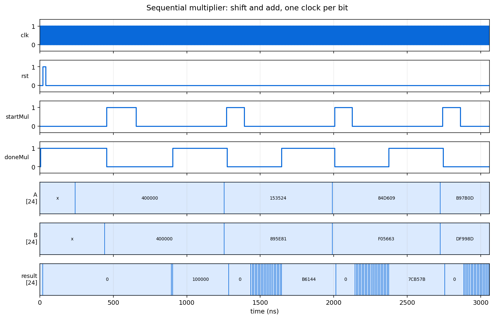

# Digital Logic Design

Verilog exercises building up from a single gate to a sequential floating-point
multiplier, each with its own testbench.



## Requirements

[Icarus Verilog](https://steveicarus.github.io/iverilog/) and `make`.

## Simulating

```bash
make sim              # every design that has a testbench
make sim-multiplier   # just one
```

Targets: `sim-nand`, `sim-mux-nand`, `sim-mux-tristate`, `sim-multiplier`.

## The designs

**CA1, gates and multiplexers.** A NAND gate and a tri-state buffer built from
primitives, then the same 2-to-1 multiplexer constructed twice: once from NAND
gates and once from tri-state buffers. `CA1_Q5_TB` drives both with identical
stimulus so the two constructions can be compared directly.

Two ways of reaching the same truth table with different characteristics. The
NAND version always drives its output; the tri-state version can leave the line
floating, which is what makes it usable on a shared bus and what makes contention
possible if two drivers are enabled at once.

**CA3, a one-counter.** Counts the set bits in a word. The file here is the
post-synthesis netlist, so it instantiates vendor primitives and needs that
library to simulate.

**CA5, timing and glitches.** The same design before and after synthesis, plus a
pair that differ only in whether a glitch is present. Comparing pre- and
post-synthesis behaviour is the point: they agree functionally and differ in
timing, and a design correct on paper can still glitch once real gate delays are
in play.

**CA6, a sequential multiplier.** The largest design here, split into a
controller and a datapath. Rather than a combinational array of adders it shifts
and adds one bit per clock, trading throughput for a fraction of the area. The
waveform above shows four multiplications, each bracketed by `startMul` going
high and `doneMul` coming back.

`floating_point_mul.v` extends the same datapath to a floating-point mantissa
multiply.

## Project structure

```
CA1/    gates, tri-state buffers, and two multiplexer constructions
CA3/    post-synthesis one-counter netlist
CA5/    pre- and post-synthesis comparison, and a glitch study
CA6/    sequential multiplier: top, controller, datapath, full adder
        floating_point_mul.v extends it to mantissa multiplication
docs/   the figure above
Makefile
```
